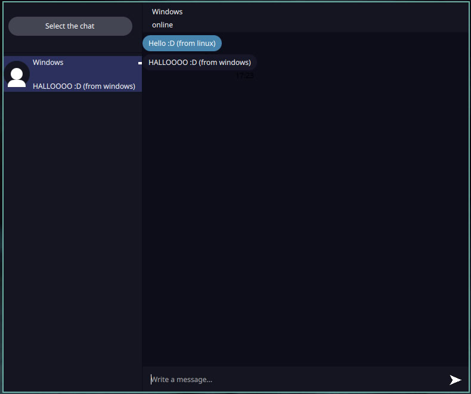

# P2P Messanger

Hello, this is my pet project (in education purposes only).

I made a messanger based on p2p connection.
I made UI looking like Telegram. But i'ts really bare bones, not a lot of features, only text messages.

# Stack:

 - C++ (17)
 - Qt/qml
 - Cmake

# Screenshots:

 
 

# Dependencies: 

## For Linux

Qt version: 6.8

## For Windows

Qt version: 6.10.2

Change the path to Qt in order to match your path.
To see the default path for Qt look CMakeFiles.txt 14 line.

Note: project was build on Linux Debian 13, also there is could be problems with connecting with windows, you gotta turn off firewall for udp ports (use at your own risk).